# 1. External configuration store pattern
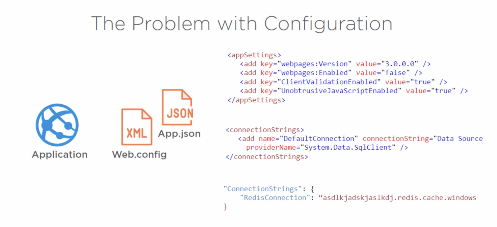

if application is deployed in globally different regions
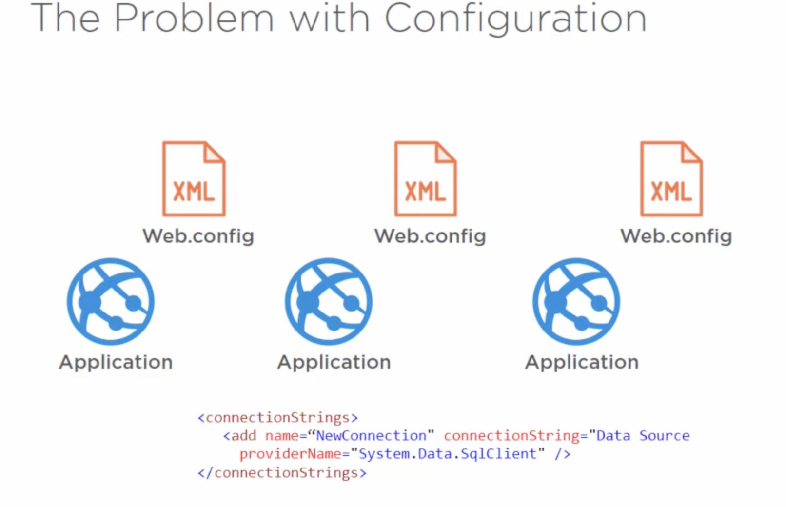
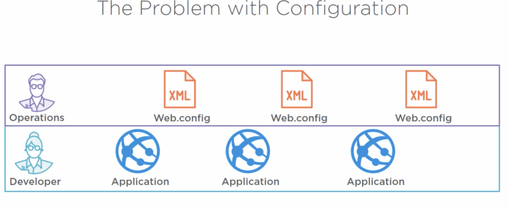

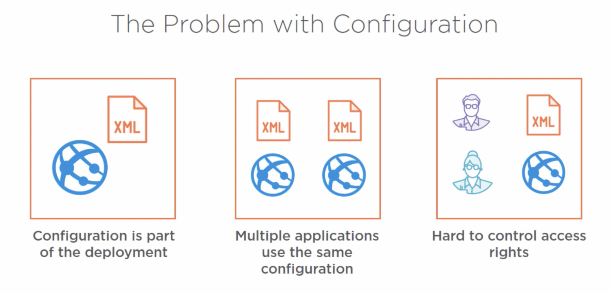

## solution to the problem
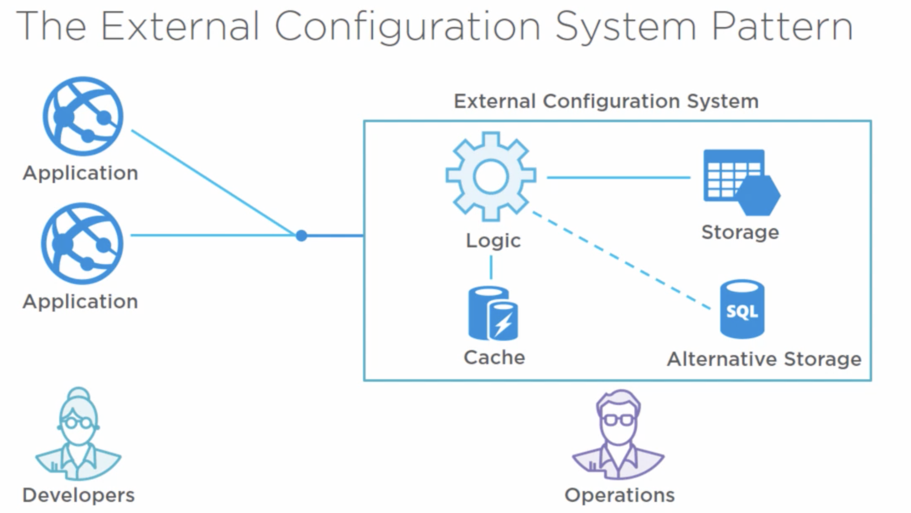

## Things to consider
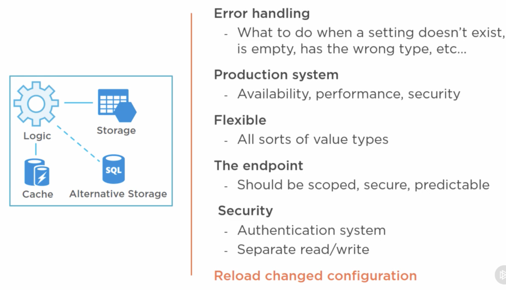
 1) Availablity
 2) Performance
 3) Secure
 4) Error handling

 Endpoint
  a) Scope(app, env)
  b) Format(key/value, type)
  c)Authentication

Auth system
 a) only operation team has access,
 b) Security Rules

 ## useage of pattern
 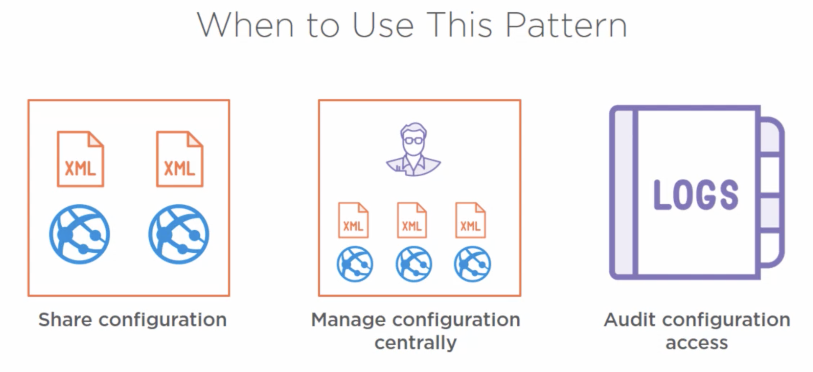

# 2. Federated identity pattern
Problems with identity and access

## solution to the problem
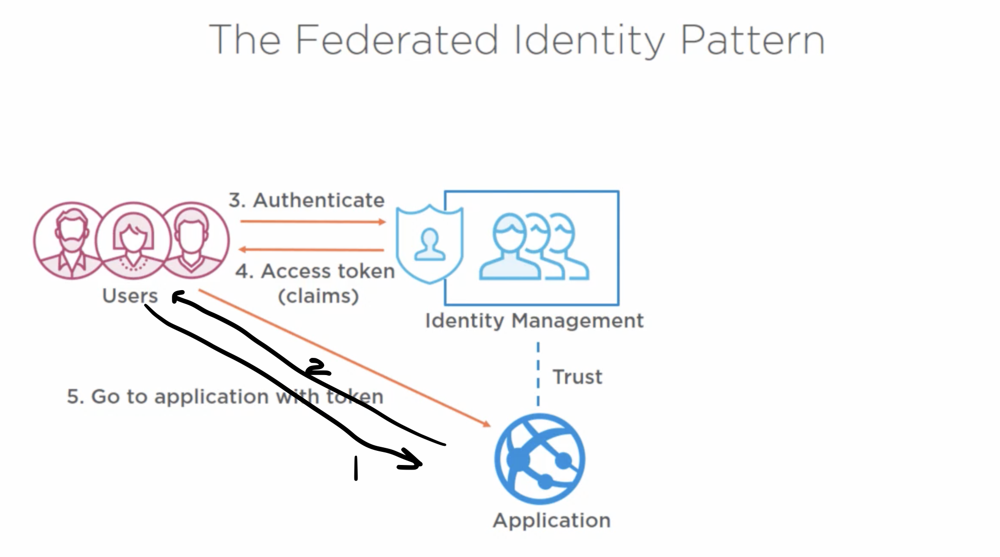

## Things to consider
it is production system

# 3. Gatekeeper pattern
problems exposing cloud services to internet
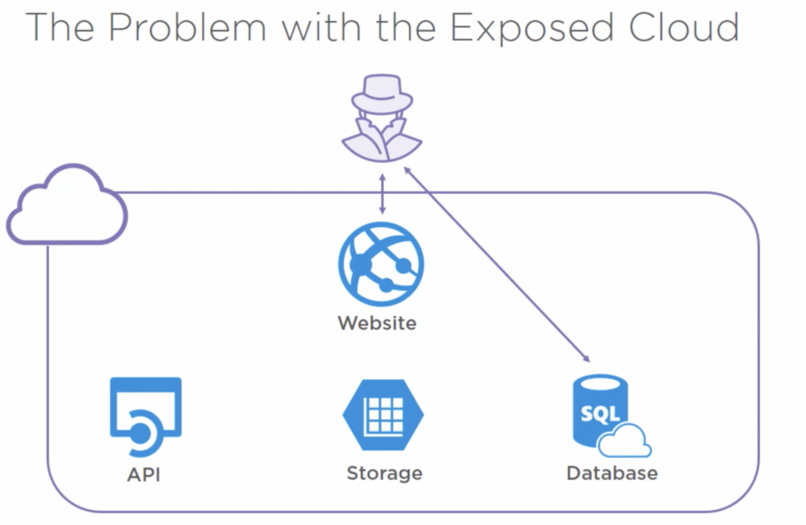
a) SQL injections
b) Cross-site  scripting
c) Dos attack
d) Steal data

## solution to the problem

## Things to consider
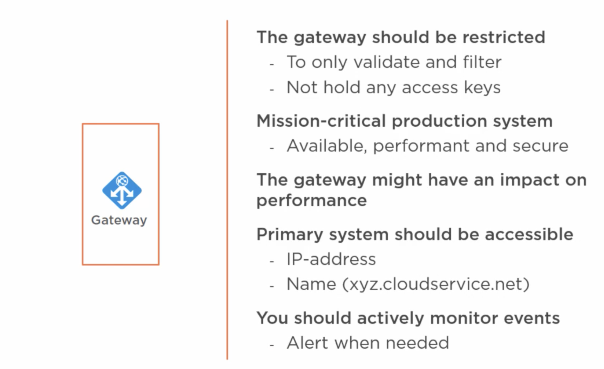

## when to use this
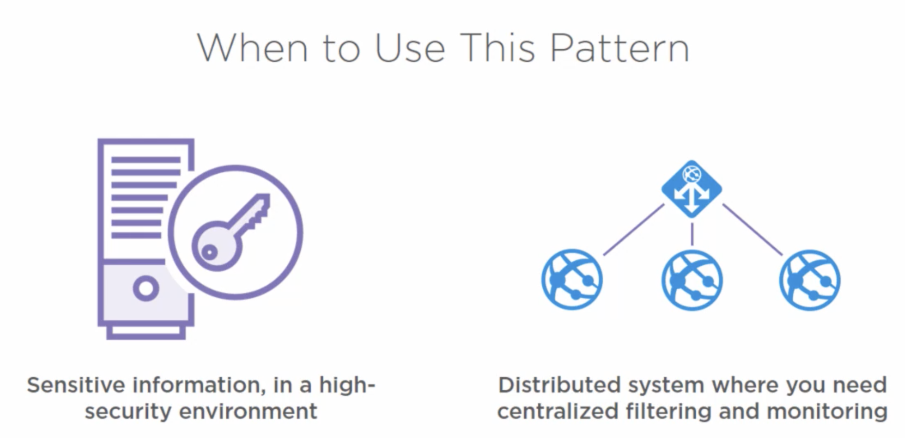

# 4. Auto scaling pattern
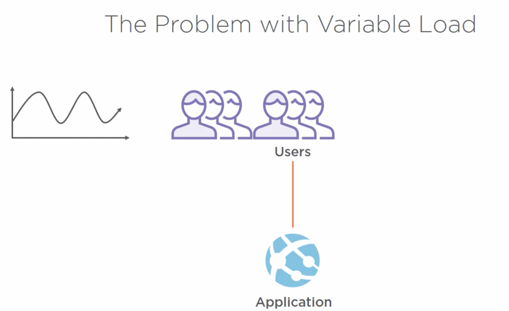
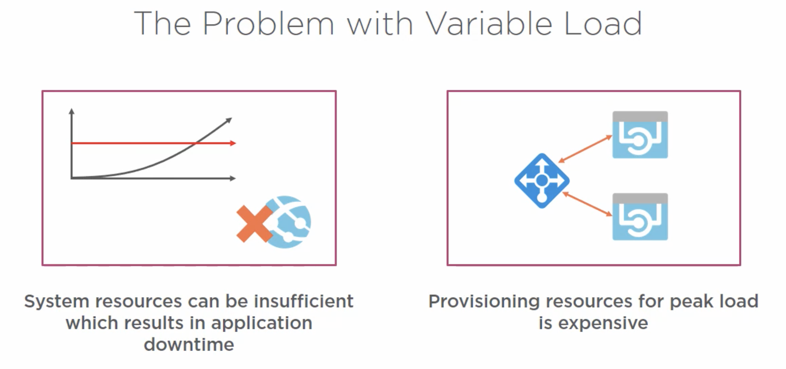

## solution is
 scale the application
 1) Vertical scaling
 2) Horizontal scaling
 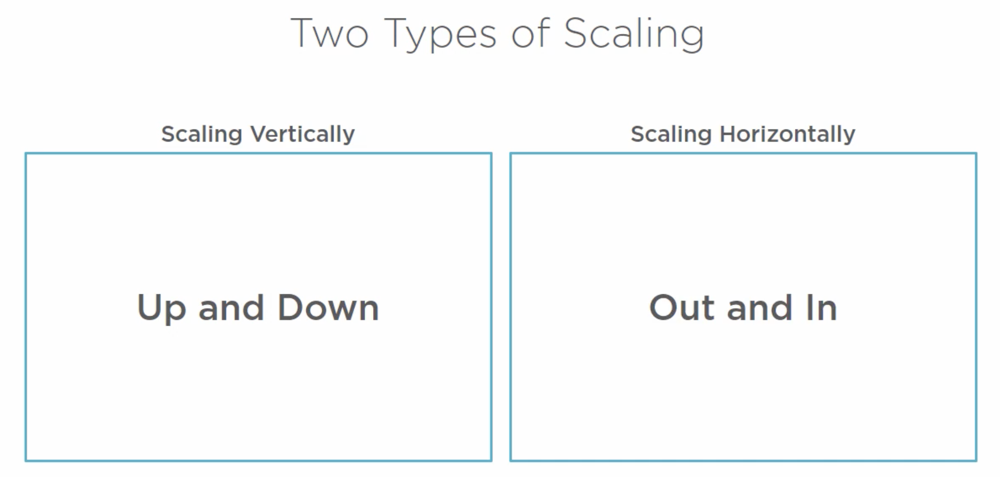
 

 ## Things to consider
 

 ## when to use
 1) To guarantee application uptime
 2) To befit from scaling(reduce cost by scaling)
  
# 5. Cache aside pattern
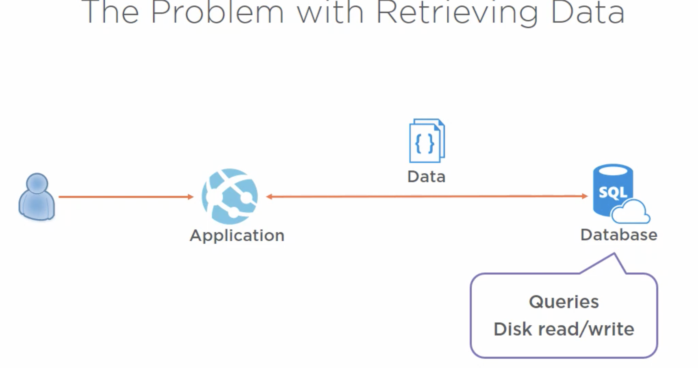

## solution 

## Things to consider
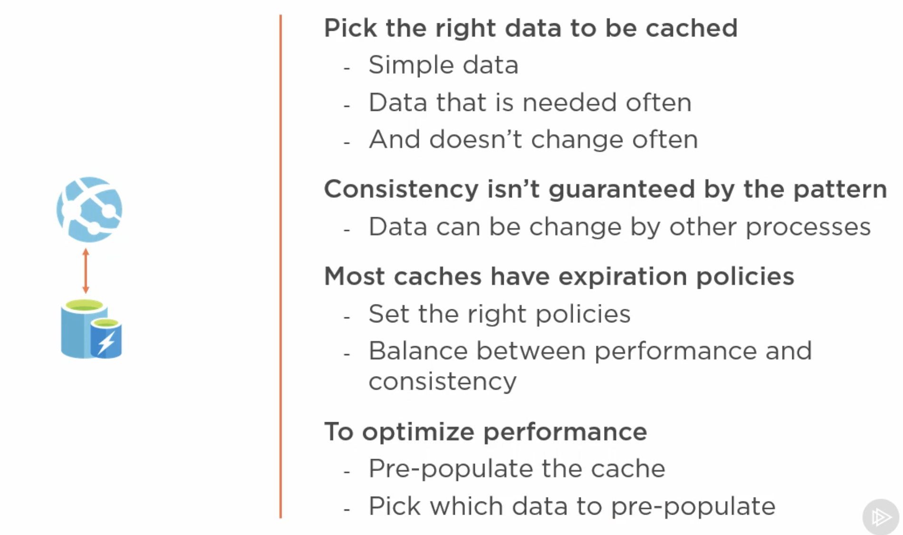

# 6. Command and Query responsibility segregration(CQRS) pattern

causes data lock and data conflicts
scalling is inefficent

## solution
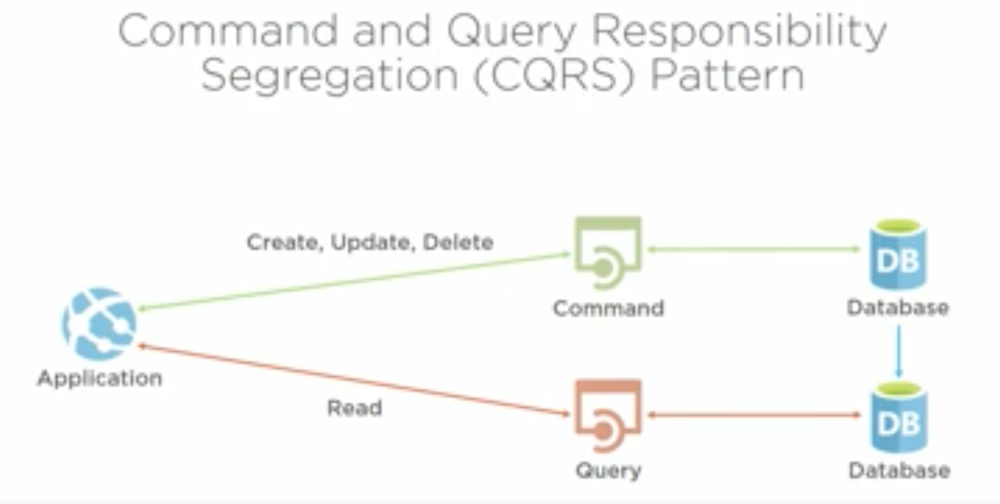

## Things to consider
Need to consieder data sync, it is causes eventual consistency
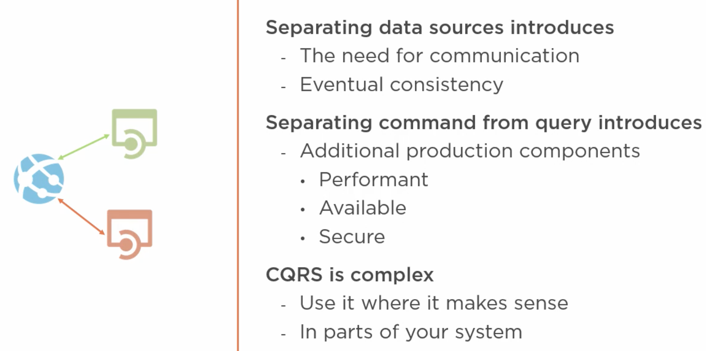

## when to use this

Not to use

# 7. Event sourcing pattern

# 8 Sharding pattern

# 9 static content hosting pattern