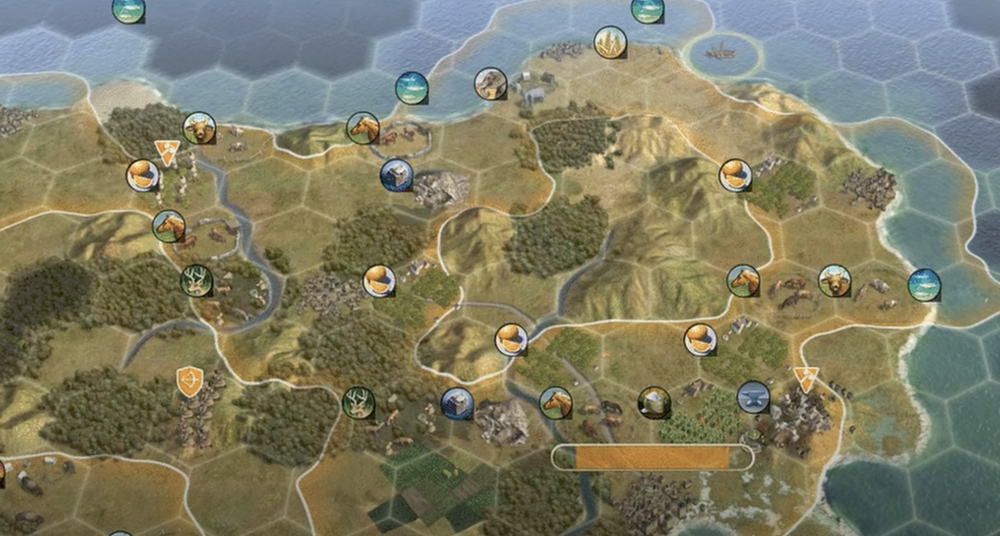
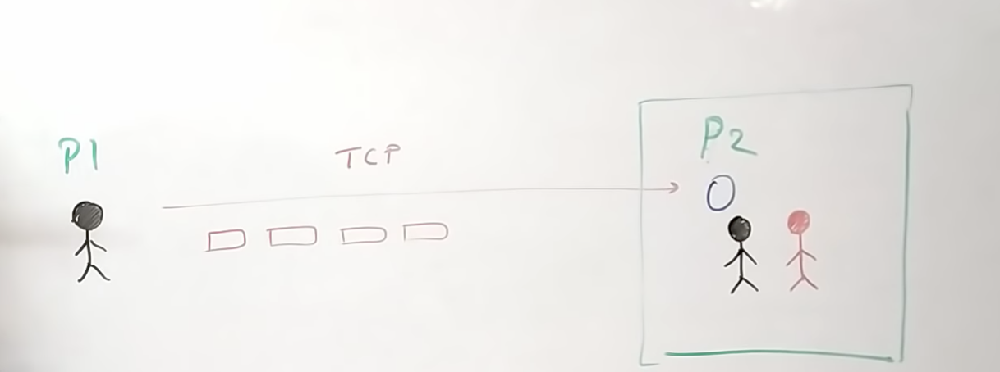
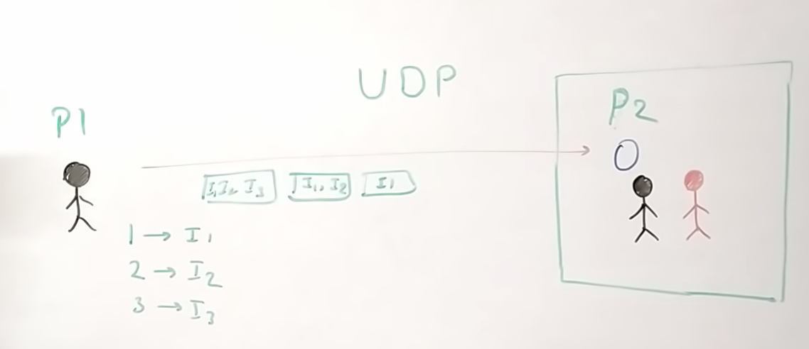
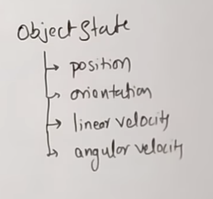
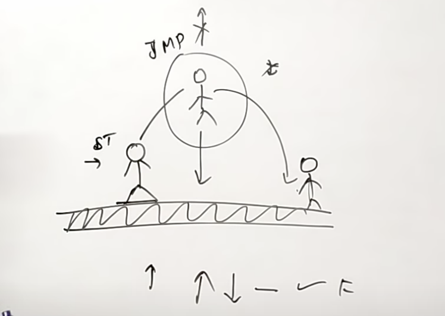

# Online gaming 
- games are developed using unity or unreal engine frameworks

- online gamaing has mainfunctionality game loop
- it has 3 differnt functionalities
    - check input
    - update game state
    - render screen
    

- Take user input update state and finallyu render the output, in case of online games this state need to be updated across all players

- Different types of games
    - Stratgic games
    - Slow turn games
    - First person games

- Stratgic games
    - kind of war games
    - These are difficult to design UI part but backend is easy compared to others
    

- Slow turn games
    - chess or poker
    - no conficts, have enough time for each player to play and update the state and no concurrency

- First person games
    - pubg
    - couple of players playing together and interactions.
    - tough to sync state

we will concentrate on "First person games" because they are difficult.

## How Latency come into picture
- we can send faster than light
 speed.
- Apart from this latency, again router, repeters also add some latency.

image representing little latency in play1 and player2

There is no way to replicate state of one player to another, they is little latency
- To avoid this latency what about peer to peer communication insterd of server in the middle ?
    - problem is end players may hack it using scriptings and automate the updates.
    - If server is present, it monitors and contrils the user input.(that is called Authoritative server)

## What can you do to reduce the bandthwidth
- stratagies to reduce the network delay
    -   Deterministic lock
    - State synchronization

## Deterministic lock

- sending only palyer input information to the other players.
- Based on the received i/p, other players simulate state chagnes.
- It takes less number of bytes, so fast.
- If we want to send state orientation position, that is huge date and takes more bandwindth and time
ex: https://www.youtube.com/watch?v=EU81tjgoKoI&t=1358s  - 22:58

- Problems with this approach
    - 
    - Assume there are 2 players, and player1 sending input info to thers, if player 2 didn't recieve the info, player1 continue to play, but player-2 gets stuck. so there is change in user experience.
- How to solve this problem ?
- normal communication is 2 types
    - TCP - UDP
    - Playout buffer

- Playout buffer
    - like in youtube videos, before video starting itself, it will load some packets like pre load and then start video streaming, so taht even in the middle if there is delay we don't see that buffering

    - 

    - in the same way adda buffer on the player side

- TCP
    - in case of any packet lost, in TCP it has to send that lost packet before transmistting the other packets. That interoduces additional delay

- UDP
    - In UPD, no ack, we sendin instead of individual pcket, we can send duplicate copy of previous pkg, so if packet is lost in one attempt, it can be received in another
    - 

## State synchronization
- In this case we pass complete state object from one player to another player, so even some time info is lost in the next packet we can get the ino and recereate the scenario.
- Data is huge it takes more bandwidth
- Though we transfer the complete state obj, still there might be change of jitter and non sync
- so we have to do some prediction for interpolation
- 

How to handle different states
- 

So think object in every object as a state. And for each state you can define the possibley of options and actions. Use State design Pattern for this

State machine
- 

# References:

https://www.youtube.com/watch?v=EU81tjgoKoI&t=1358s
