# Online gaming 
- games are developed using unity or unreal engine frameworks
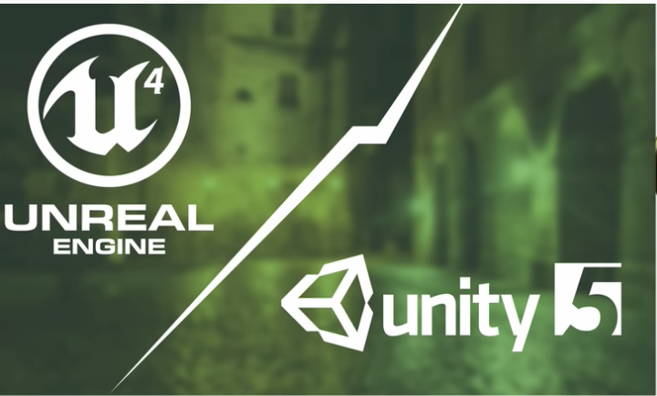

- online gamaing has mainfunctionality game loop
- it has 3 differnt functionalities
    - check input
    - update game state
    - render screen
    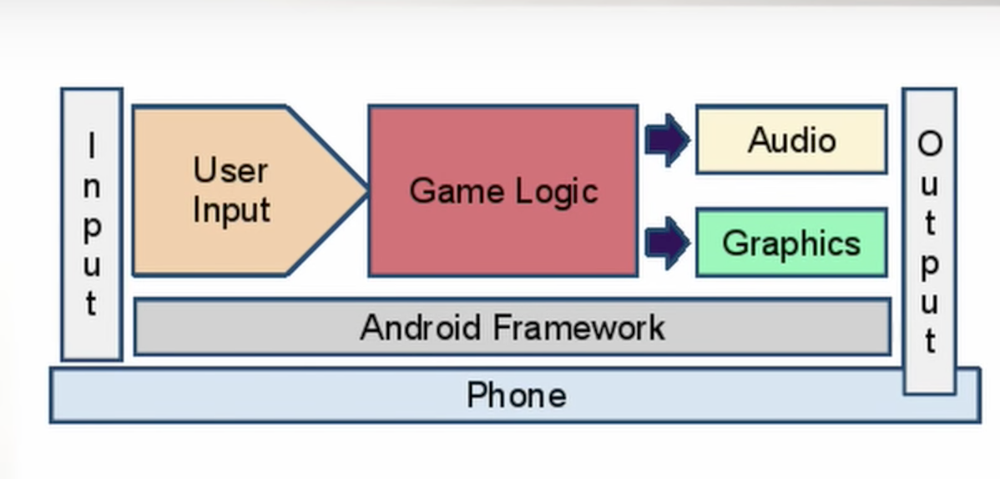

- Take user input update state and finally render the output, in case of online games this state need to be updated across all players

- Different types of games
    - Stratgic games
    - Slow turn games
    - First person games

- Stratgic games
    - kind of war games
    - These are difficult to design UI part but backend is easy compared to others
    

- Slow turn games
    - chess or poker
    - no conficts, have enough time for each player to play and update the state and no concurrency

- First person games
    - pubg
    - couple of players playing together and interactions.
    - tough to sync state

we will concentrate on "First person games" because they are difficult.

## How Latency come into picture
- we can send faster than light
 speed.
- Apart from this latency, again router, repeters also add some latency.
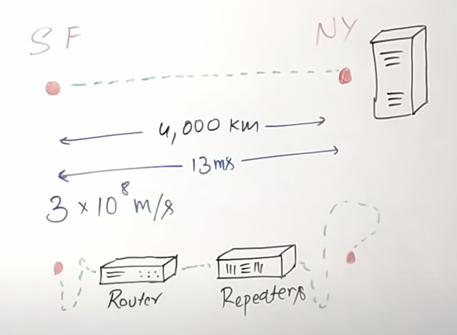

image representing little latency in play1 and player2

There is no way to replicate state of one player to another, they is little latency
- To avoid this latency what about peer to peer communication insterd of server in the middle ?
    - problem is end players may hack it using scriptings and automate the updates.
    - If server is present, it monitors and contrils the user input.(that is called Authoritative server)

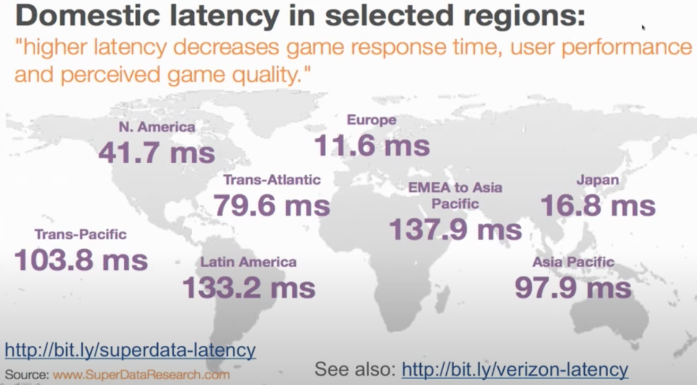
## What can you do to reduce the bandthwidth
- stratagies to reduce the network delay
    -   Deterministic lock
    - State synchronization

## Deterministic lock

- sending only palyer input information to the other players.
- Based on the received i/p, other players simulate state chagnes.
- It takes less number of bytes, so fast.
- If we want to send state orientation position, that is huge date and takes more bandwindth and time
ex: https://www.youtube.com/watch?v=EU81tjgoKoI&t=1358s  - 22:58

- Problems with this approach
    - 
    - Assume there are 2 players, and player1 sending input info to thers, if player 2 didn't recieve the info, player1 continue to play, but player-2 gets stuck. so there is change in user experience.
- How to solve this problem ?
- normal communication is 2 types
    - TCP - UDP
    - Playout buffer

- Playout buffer
    - like in youtube videos, before video starting itself, it will load some packets like pre load and then start video streaming, so taht even in the middle if there is delay we don't see that buffering

    - 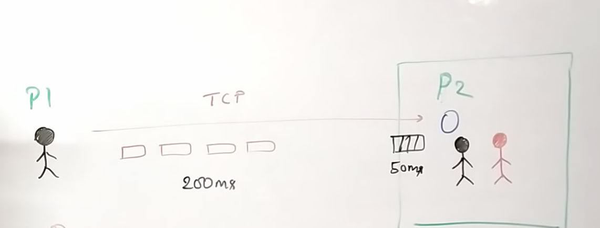

    - in the same way adda buffer on the player side

- TCP
    - in case of any packet lost, in TCP it has to send that lost packet before transmistting the other packets. That interoduces additional delay

- UDP
    - In UPD, no ack, we sendin instead of individual pcket, we can send duplicate copy of previous pkg, so if packet is lost in one attempt, it can be received in another
    - 

## State synchronization
- In this case we pass complete state object from one player to another player, so even some time info is lost in the next packet we can get the ino and recereate the scenario.
- Data is huge it takes more bandwidth
- Though we transfer the complete state obj, still there might be change of jitter and non sync
- so we have to do some prediction for interpolation
- 

How to handle different states
- 

So think object in every object as a state. And for each state you can define the possibley of options and actions. Use State design Pattern for this

State machine
- 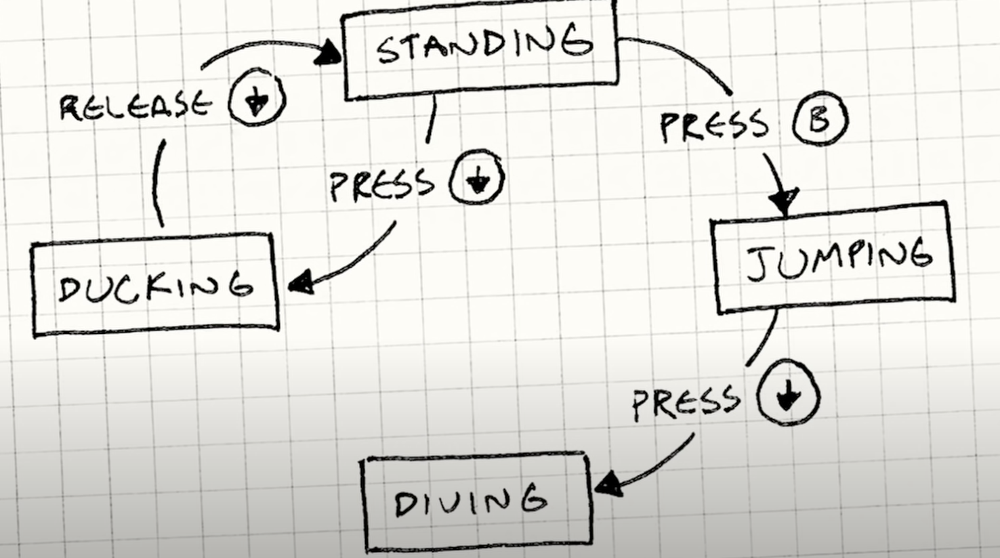

# Backend- Design
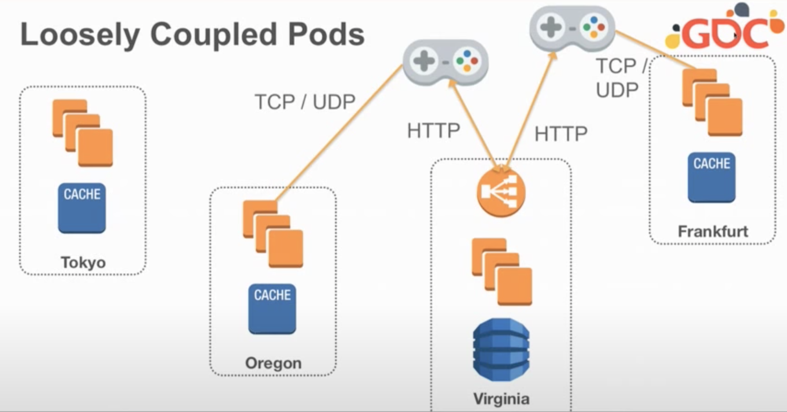
- 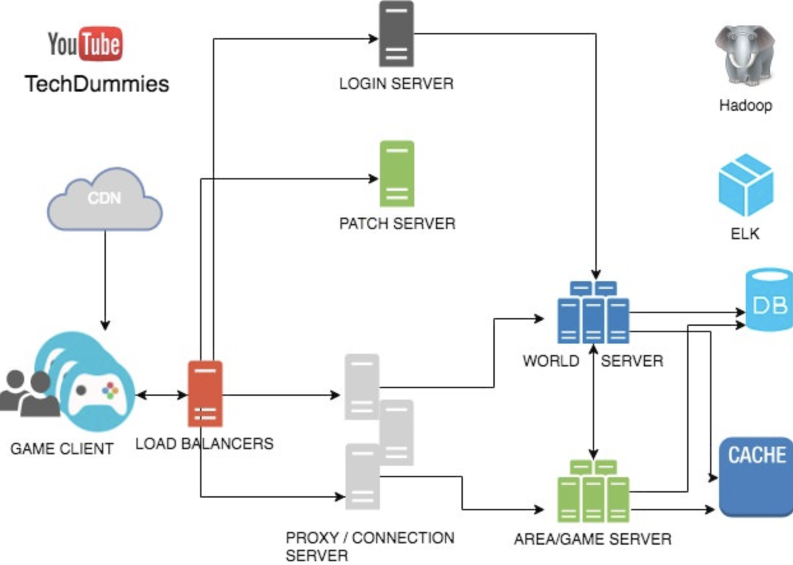

-   Client connects to path server to update the game version if any.
-   Client connects to login server to check the credentials
-   Players connect to world server to checkin their entry into the game.
-   Once multiple players are joins, games session gets established.
-   Game serve creates a instance for game, that run in one of cluster
    -   if games is simple game like only two player(chess), only one istance is
        enough and no need of distribution
    -   For a multipler games, need to distrubute across multiple custer servers
-   Clinet recives game/area server information, IP etc
-   client connects to both area/game and world server to get player info and game details.

load balancer should to smart enough to connect all players to as possblle close to servers, so that latency can be minimized

## Proxy/Connect server
In a multiplayer game if we use either TCP/UDP, we need to pass lot of info to all player. It takes lot of time to 
- decode
- decryption
- decompression  
ex : O(N) * M  
N - players
M - packets

If game server does all these operations, along with game info, it causes performace decrease.

So that's why they introduced another server to take care of above operations and games server takes care of game logic operation alone

## why game and world two servers
- 

-  In a normal games like chess only 2 players play game.
- Each server can support 10K people
- if more ppl want to play we can allocate more servers
- Where as oubg like may be 20K people want to play, how to handle it ?
- entire pubg map is split inot parts and each part is stored in differnt game server and players also get distributed, 
- we need one cetreal repo to controll all this, that server is called World server.

## How overall system works?
- 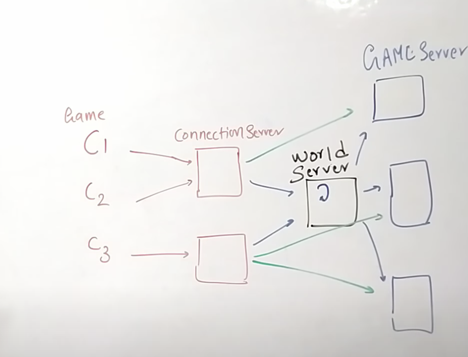

1) Palyer connects to connection server(authorization, hadling connections, termination etc)
2) connection server forwards request to world server
3) World server instantiates game session and assigns user
    -   world server just takes care of entry of player
    -   orchestrates the cross regions(means traking  or coordination the main server)
    - it stores player info it means, where the player is and what wepons he holds, his moves etc
4) once player connects to world server, he get both world server info and game server info

## Area/Game servers
-   each game server is responsible for individual area and players in that area of whole game
-   Assigning map segments to game server is dynamic and taken care by world server

- 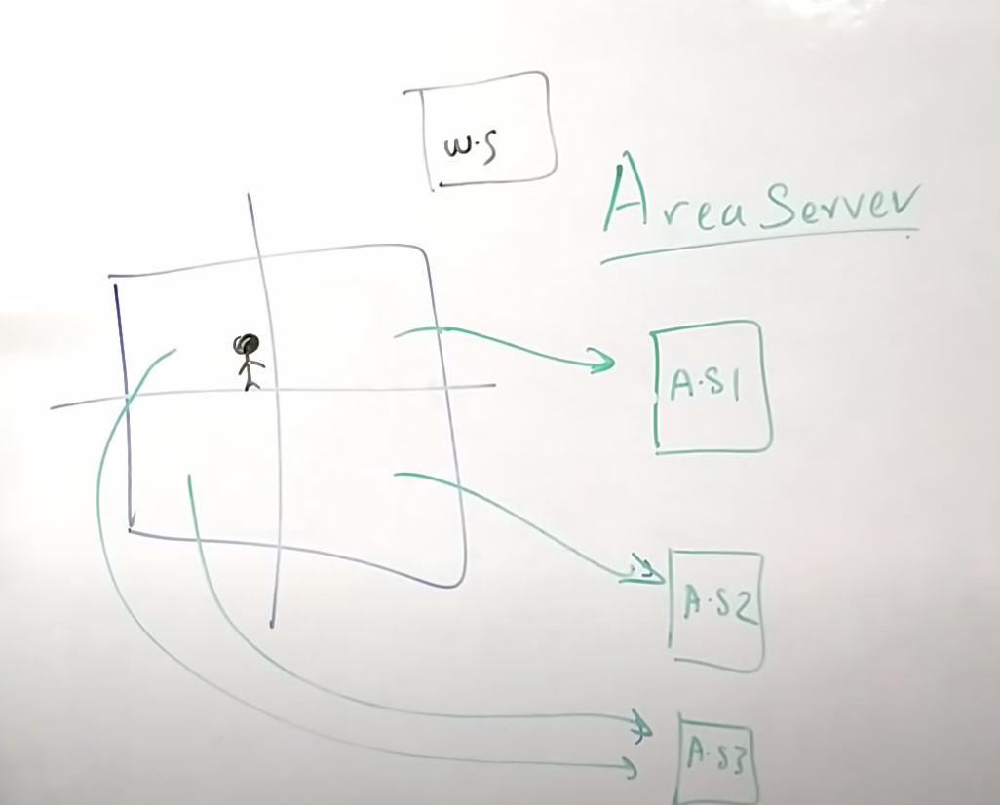 
-For a smooth transision of scenns between the maps(servers), we need to broad cast one server state info to the atleast its adjacent servers, so that if a bullet goes from one region to another region its transistion is smooth
- 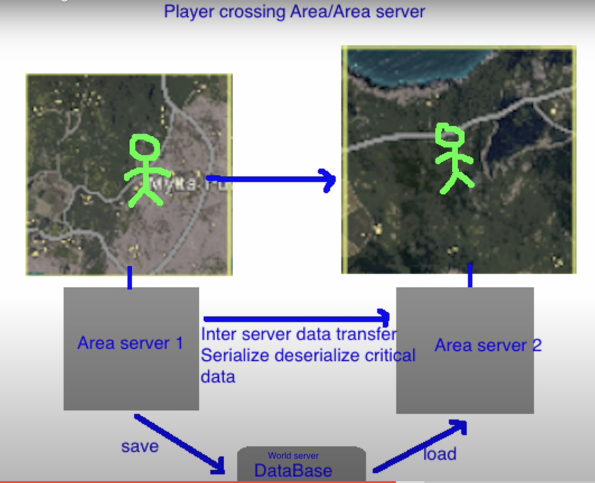 

## Patch server
- in a multiplayer every player should have same version, other wise if any changes
happen in one version, that causes players not in sync

## single threaded

## game state backup
- we have to maintain backup to avaoid any server failures.
what are the things we have to backup

1) Important bits( means player info or regions it holds, and state of allocate players in that region)
    if we save this info, we can easily conitne the session, with this info , so that game won't be interrupted.
2) only if changed.
-   It means only if the use present in that regions gets changes, then we can have a flag to identify the changed user and serialize only that info and save it
- if nothing changed, we can retain the state from initial state

3) Individual
-   Always try to serize(save) only individual objects, so it is easy to restore
4) Async
- save  async way

## Data base
-   Most of companies start with SQL DB
- later they migrated to Dynamo DB

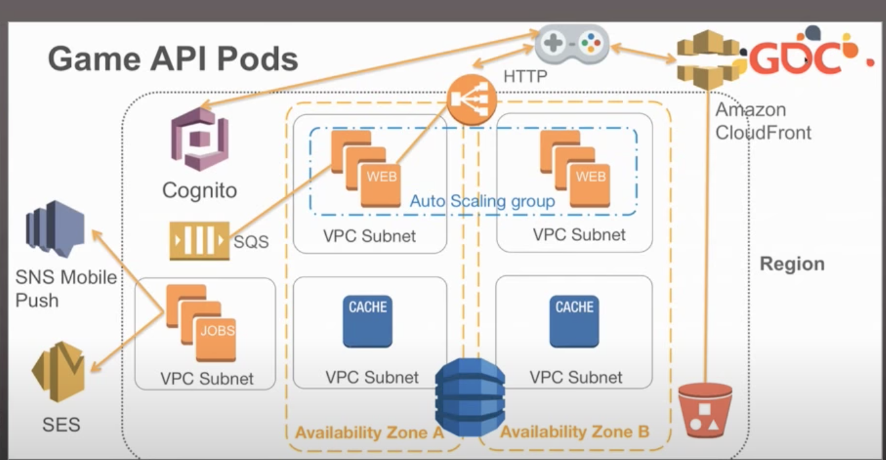 
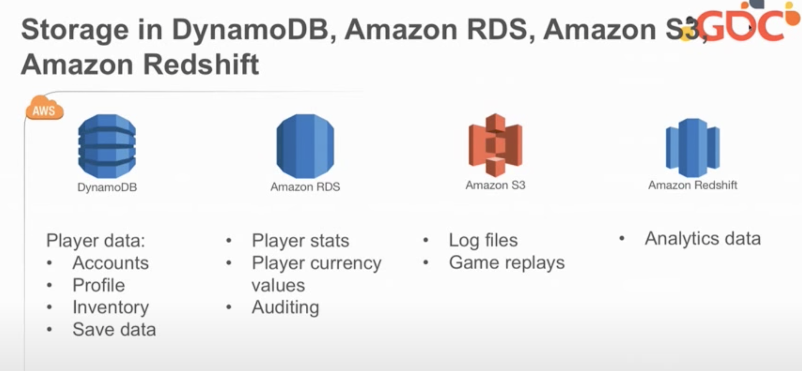 
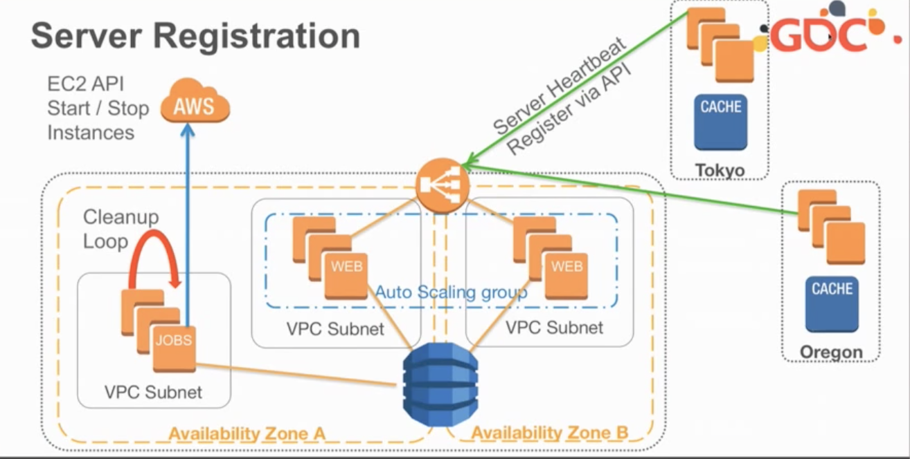 

# References:

Frontend: https://www.youtube.com/watch?v=EU81tjgoKoI&t=1358s
backend: https://www.youtube.com/watch?v=K3Z1PY2vr3Q

https://www.youtube.com/watch?v=BxQAqADGY_k
